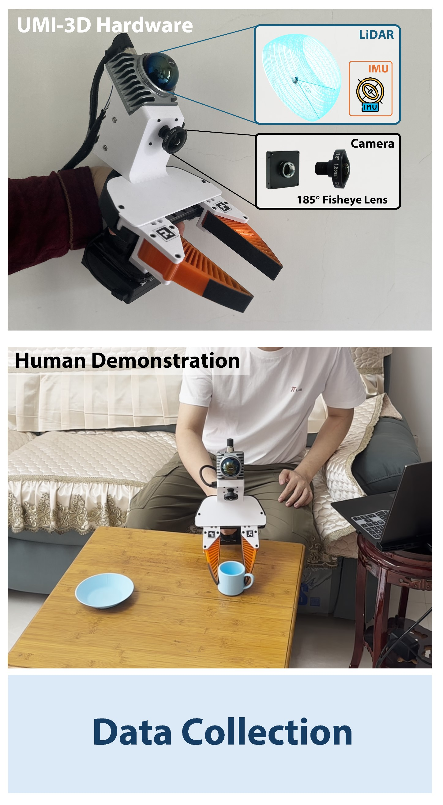
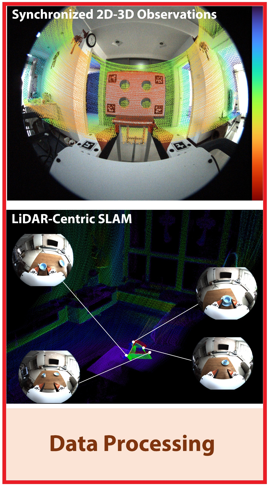
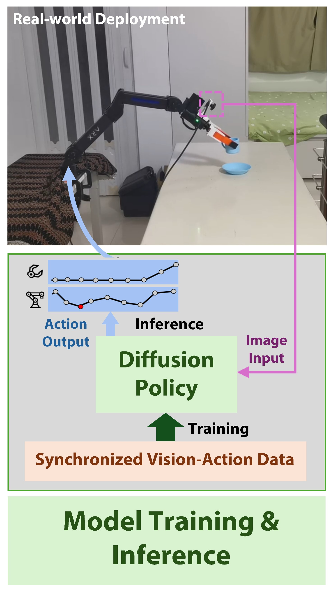
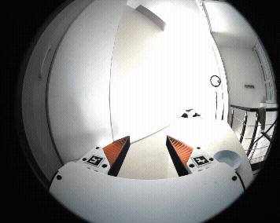
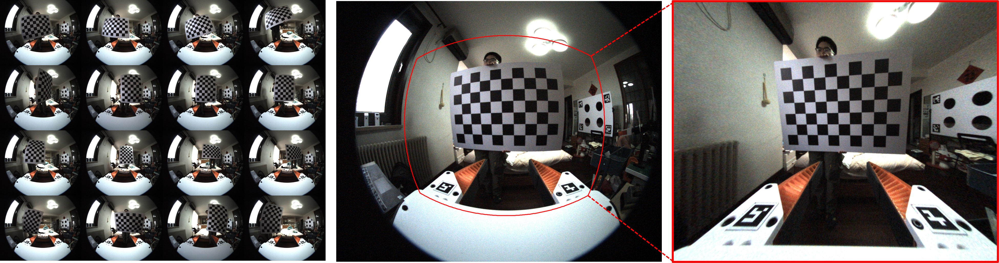
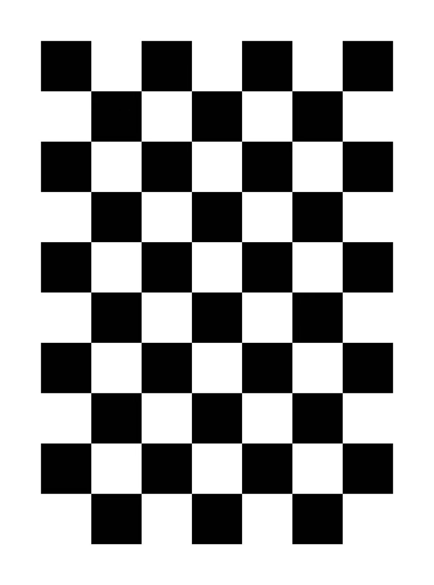
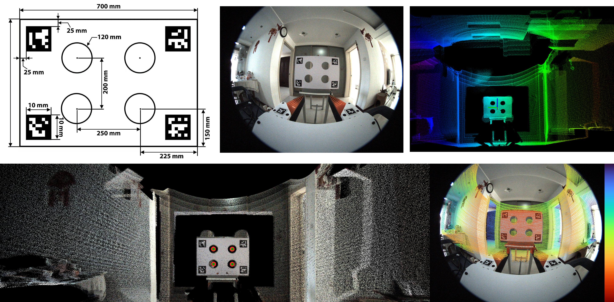
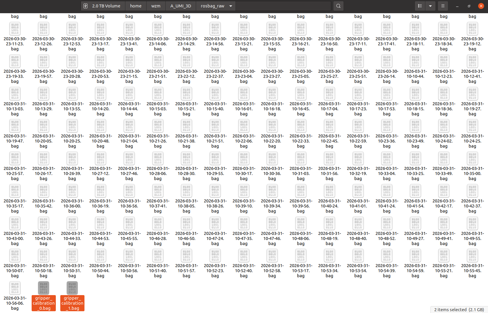
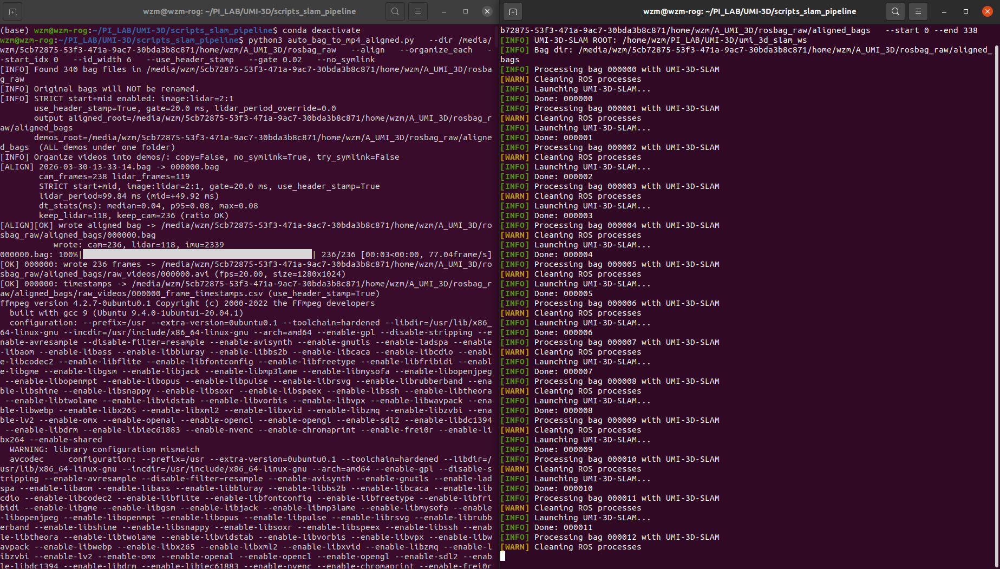
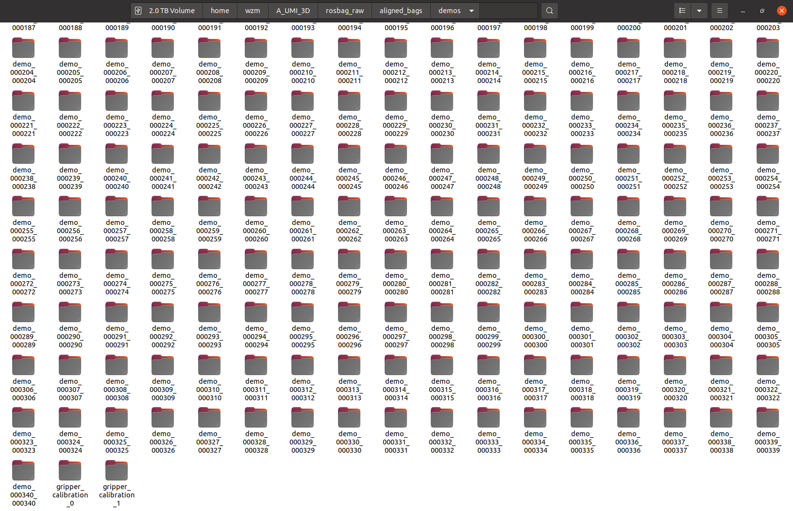

# UMI-3D SLAM and Data Processing

<div align="center">

<h3>
  🌐 <a href="https://umi-3d.github.io/">UMI-3D Project Homepage</a>
</h3>

<table>
  <tr>
    <td align="center" width="33%">
      <a href="https://github.com/Physical-Intelligence-Laboratory/UMI-3D-Hardware">
        <b>🔧 UMI-3D Hardware</b>
      </a>
    </td>
    <td align="center" width="33%">
      <a href="https://github.com/hku-mars/UMI-3D">
        <b>🛰️ UMI-3D SLAM Pipeline</b>
      </a>
    </td>
    <td align="center" width="33%">
      <a href="https://github.com/Physical-Intelligence-Laboratory/UMI-3D-Policy">
        <b>🤖 UMI-3D Policy</b>
      </a>
    </td>
  </tr>

  <tr>
    <td align="center">
      <a href="https://github.com/Physical-Intelligence-Laboratory/UMI-3D-Hardware">
        
      </a>
    </td>
    <td align="center">
      <a href="https://github.com/hku-mars/UMI-3D">
        
      </a>
    </td>
    <td align="center">
      <a href="https://github.com/Physical-Intelligence-Laboratory/UMI-3D-Policy">
        
      </a>
    </td>
  </tr>

  <tr>
    <td align="center">
      Hardware design, BOM, CAD, 3D-print parts
    </td>
    <td align="center">
      SLAM, synchronization, calibration, and data processing
    </td>
    <td align="center">
      Policy training, deployment, inference<br><br>
      <a href="https://github.com/Physical-Intelligence-Laboratory/UMI-3D-Dataset">
        <b>📦 Dataset & Models</b>
      </a>
    </td>
  </tr>
</table>

</div>


## Overview
UMI-3D provides a complete end-to-end pipeline, transforming **raw rosbag recordings** into **training-ready datasets** for embodied manipulation learning:
```
Collected rosbag Files
  ↓
Calibration  
  ↓
SLAM
  ↓
Aligned Demos
  ↓
Dataset Pipeline
  ↓
Zarr Dataset (for policy training, e.g. Diffusion Policy)
```

## 0. Complete Data Collection

To build the UMI-3D data collection system, please follow the hardware assembly and sensor setup instructions in:

👉 https://github.com/Physical-Intelligence-Laboratory/UMI-3D-Hardware

UMI-3D collects two types of data:

1. **Demonstration data**  
   Human-guided manipulation trajectories captured during task execution.

2. **Gripper calibration data**  
   Slowly open and close the gripper for approximately 5 cycles to estimate gripper motion range.

<div align="center">
  
  
</div>

All data are recorded as **rosbag files**, including:
- LiDAR point clouds  
- IMU measurements  
- Camera images  

These recordings serve as the raw input for the full UMI-3D data processing pipeline.

## 1. Sensors Calibration
<div align="center">
  
  
</div>

### 1.1 Fisheye Camera Intrinsic Calibration

**Step 1 — Collect calibration images**

- Use a checkerboard (**6 × 9 inner corners**, square size = **0.10 m**, configurable in script)  
- Capture ≥ 100 images with different positions (center / edges / corners), orientations, and distances  
- Save all images to `fisheye_intrinsics/images/`

**Step 2 — Run calibration**

```bash
cd fisheye_intrinsics

python3 calibrate_fisheye_intrinsics.py \
    --image_glob "images/*.png" \
    --checkerboard_cols 6 \
    --checkerboard_rows 9 \
    --square_size 0.10 \
    --output_dir calib_output
```

Calibration results will be saved to: `fisheye_intrinsics/calib_output/`


### 1.2 LiDAR–Camera Extrinsic Calibration

<div align="center">
  
</div>

This step estimates the rigid transformation between the Livox MID-360 LiDAR and the fisheye camera.

---

**Step 1 — Prepare calibration data**

- Record a **static rosbag** containing:
  - Livox point cloud (`/livox/lidar`)
  - Camera images  
- Place the rosbag into: `livox2cam_calibration/src/calib_data/`

- Fill in the previously calibrated camera intrinsics into: `livox2cam_calibration/src/config/qr_params.yaml`

- Calibration board files are provided here:  [Calibration Board Files](sensors_calibration/livox2cam_calibration/src/calib_borad_files)


---

**Step 2 — Build and Run**

**Prerequisites:**
- Ubuntu 20.04, ROS Noetic
- PCL ≥ 1.8  
- OpenCV ≥ 4.0  
```bash
conda deactivate

# Build
cd livox2cam_calibration
catkin_make

# Run Calibration
source devel/setup.bash
roslaunch livox2cam_calibration calib.launch
```
- Output: Extrinsic transformation between LiDAR and camera (rotation + translation)


## 2. UMI-3D SLAM

This module performs LiDAR–inertial SLAM to estimate the camera trajectory and reconstruct the environment.

---

**Step 1 — Configure extrinsics** 

Fill the calibrated LiDAR–camera extrinsic parameters into: `umi_3d_slam_ws/src/umi_3d_slam/config/mid360_180.yaml`


---

**Step 2 — Install dependencies**

- **Environment:** Ubuntu 20.04, ROS Noetic   

- **Libraries:** PCL ≥ 1.8, Eigen ≥ 3.3.4, OpenCV ≥ 4.2  

- **Install Sophus:**

  ```bash
  git clone https://github.com/bitcat-tech/Sophus
  cd Sophus
  mkdir build && cd build
  cmake ..
  make
  sudo make install
  ```
---
**Step 3 — Build the SLAM system** 
```
conda deactivate
cd umi_3d_slam_ws
catkin_make
```

---
**Step 4 — Run SLAM Demo**
```
source devel/setup.bash

# Start SLAM
roslaunch umi_3d_slam mapping_mid360_180.launch rviz:=true

# Play rosbag
rosbag play YOUR_DEMO.bag
```
- Output: Estimated camera trajectory saved in `umi_3d_slam_ws/src/umi_3d_slam/output/camera_trajectory.csv`

> **Note**: Ensure proper time synchronization between LiDAR and camera.

## 3. Data Processing for Training
### 3.1 Rosbag Preprocessing

This stage converts raw rosbag recordings into **time-aligned multi-modal data**, and prepares them for SLAM and dataset generation.

The pipeline consists of two main steps:

```
Raw rosbags
   ↓
auto_bag_to_mp4_aligned.py   (alignment + video export)
   ↓
aligned_bags/
   ├── demos/
   ├── 000000.bag ...
   ↓
auto_umi_3d_slam.sh         (trajectory estimation)
   ↓
Final demos with trajectory
```

---

#### Step 1 — Prepare Raw Rosbags

Place all raw rosbags into a single directory:

```
/path/to/your/rosbags/
    ├── 2026-03-30-13-33-14.bag
    ├── 2026-03-30-13-33-37.bag
    ├── ...
    ├── 20xx-xx-xx-xx-xx-xx.bag
    ├── gripper_calibration*.bag
```

<div align="center">
  
</div>

---

#### Step 2 — Multi-modal Alignment and Video Export

Run the preprocessing script:

```bash
conda deactivate

python3 scripts_slam_pipeline/auto_bag_to_mp4_aligned.py \
  --dir /path/to/your/rosbags \
  --align \
  --organize_each \
  --start_idx 0 \
  --id_width 6 \
  --use_header_stamp \
  --gate 0.02 \
  --no_symlink
```

---

##### 🔍 What this script does

- Synchronizes:
  - LiDAR (Livox)
  - Camera images
  - IMU
- Uses **timestamp gating (`--gate 0.02`)** for alignment
- Re-indexes all demos into consistent IDs
- Converts image streams into MP4 videos
- Outputs per-frame timestamps

---

##### 📂 Output structure

```
aligned_bags/
├── demos/
│   ├── demo_000000_000000/
│   │   ├── raw_video.mp4
│   │   ├── raw_video_timestamps.csv
│   │   └── source.txt
│   ├── demo_000001_000001/
│   │   ├── ...
│
├── 000000.bag
├── 000001.bag
├── ...
```

Each demo folder corresponds to one aligned sequence.

---

#### Step 3 — Run SLAM for Trajectory Estimation

Run batch SLAM processing:

```bash
conda deactivate

bash scripts_slam_pipeline/auto_umi_3d_slam.sh \
  --bag_dir /path/to/your/rosbags/aligned_bags \
  --start 0 \
  --end YOUR_BAG_NUMBER
```

---

##### 🔍 What this script does

Based on the implementation :contentReference[oaicite:0]{index=0}:

- Iterates over each indexed bag (`000000.bag`, `000001.bag`, ...)
- For each bag:
  1. Launches **UMI-3D SLAM system**
  2. Plays rosbag
  3. Waits for trajectory output
  4. Moves result to corresponding demo folder:
     ```
     demos/demo_xxxxxx_xxxxxx/camera_trajectory.csv
     ```
  5. Optionally deletes processed bag to save disk space

---

##### 📂 Final Output

```
aligned_bags/
├── demos/
│   ├── demo_000000_000000/
│   │   ├── raw_video.mp4
│   │   ├── raw_video_timestamps.csv
│   │   ├── camera_trajectory.csv   ← SLAM output
│   │   └── source.txt
│
├── ...
```

<div align="center">
  
</div>

<div align="center">
  
</div>


### 3.2 UMI-format Training Data Packaging

This stage converts the preprocessed aligned demos into a **UMI-format replay buffer** for policy training.

The full pipeline is wrapped by:

```bash
python run_dataset_pipeline.py \
  --session_dir /path/to/aligned_bags \
  --output /path/to/aligned_bags/DATASET_NAME.zarr.zip
```

The pipeline runs four stages in order:

```text
aligned_bags/
   └── demos/
        ├── demo_xxxxxx_xxxxxx/
        │    ├── raw_video.mp4
        │    ├── raw_video_timestamps.csv
        │    ├── camera_trajectory.csv
        │    └── source.txt
        ├── gripper_calibration*/
        │    ├── raw_video.mp4
        │    ├── raw_video_timestamps.csv
        │    └── tag_detection.pkl
   ↓
00_detect_aruco.py
   ↓
01_run_calibrations.py
   ↓
02_generate_dataset_plan.py
   ↓
03_generate_replay_buffer.py
   ↓
DATASET_NAME.zarr.zip
```

---

#### Step 1 — Install environment

**System dependencies**
```bash
sudo apt install -y libosmesa6-dev libgl1-mesa-glx libglfw3 patchelf
```

**Conda environment**

We recommend using [Miniforge](https://github.com/conda-forge/miniforge) instead of the standard Anaconda distribution.

```bash
mamba env create -f conda_environment.yaml
conda activate umi
```

---

#### Step 2 — Prepare inputs

Before running the dataset pipeline, make sure your session directory already contains:

- `demos/demo_*/raw_video.mp4`
- `demos/demo_*/raw_video_timestamps.csv`
- `demos/demo_*/camera_trajectory.csv`
- `demos/gripper_calibration*/raw_video.mp4`

You also need:

- camera intrinsics: `example/calibration/fisheye.json`
- ArUco configuration: `example/calibration/aruco_config.yaml`

If needed, you can override them with:

```bash
--camera_intrinsics /path/to/custom_fisheye.json
--aruco_config /path/to/custom_aruco_config.yaml
```

---

#### Step 3 — Run the full dataset pipeline

```bash
conda activate umi

python run_dataset_pipeline.py \
  --session_dir /path/to/aligned_bags \
  --output /path/to/aligned_bags/DATASET_NAME.zarr.zip 
```


---

#### Output Summary

After the full pipeline finishes, the main outputs are:

```text
aligned_bags/
├── demos/
│   ├── demo_000000_000000/
│   │   ├── raw_video.mp4
│   │   ├── raw_video_timestamps.csv
│   │   ├── camera_trajectory.csv
│   │   ├── tag_detection.pkl
│   │   └── source.txt
│   ├── ...
│   ├── gripper_calibration*/
│   │   ├── raw_video.mp4
│   │   ├── raw_video_timestamps.csv
│   │   ├── tag_detection.pkl
│   │   └── gripper_range.json
│
├── dataset_plan.pkl
└── DATASET_NAME.zarr.zip
```

> **Note:** This version is currently designed for the **single-gripper UMI-3D setup**, where `camera_idx` is fixed to 0.


## 4. Next Step: Policy Training and Deployment

After obtaining the final dataset:

```bash
DATASET_NAME.zarr.zip
```

you can proceed to policy training and real-world deployment using the UMI-3D Policy framework:

👉 https://github.com/Physical-Intelligence-Laboratory/UMI-3D-Policy

This repository provides:

- Diffusion policy training
- Real-world deployment on robotic platforms
<div align="left"> <a href="https://github.com/Physical-Intelligence-Laboratory/UMI-3D-Policy">  </a> </div> 

## Citation

If you find this work useful for your research, please consider citing:

```bibtex
@misc{wang2026umi3dextendinguniversalmanipulation,
  title={UMI-3D: Extending Universal Manipulation Interface from Vision-Limited to 3D Spatial Perception},
  author={Ziming Wang},
  year={2026},
  eprint={2604.14089},
  archivePrefix={arXiv},
  primaryClass={cs.RO},
  url={https://arxiv.org/abs/2604.14089}
}
```

## Acknowledgements

This project builds upon a number of outstanding open-source works in LiDAR SLAM, calibration, and embodied perception, including: [UMI](https://github.com/real-stanford/universal_manipulation_interface), [VoxelMap](https://github.com/hku-mars/voxelmap),  [FAST-LIVO2](https://github.com/hku-mars/fast-livo2), [FAST-LIO](https://github.com/hku-mars/FAST_LIO), [IKFoM](https://github.com/hku-mars/IKFoM), [velo2cam_calibration](https://github.com/beltransen/velo2cam_calibration), [FAST-Calib](https://github.com/hku-mars/FAST-Calib). We sincerely thank the authors and contributors of these projects for their pioneering work and valuable contributions to the community, which have greatly inspired and enabled the development of UMI-3D.